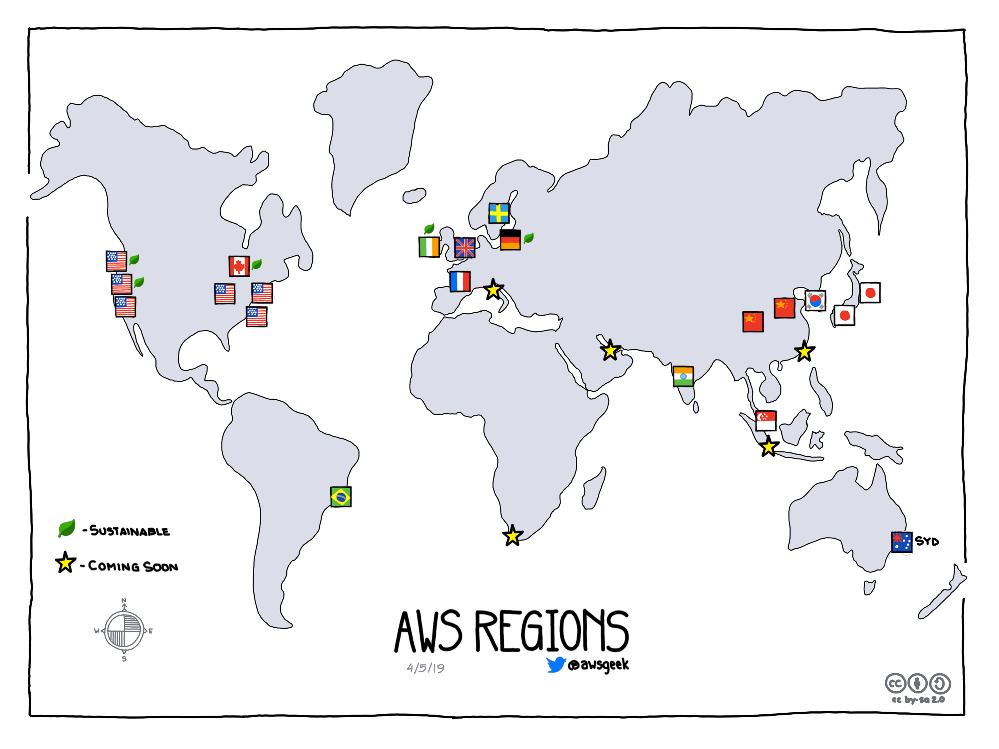

# Green Cost Explorer - climate related spend analysis for AWS
[](#contributors)

If you work in technology, it's reasonable to think that you have some respect for science.

And if you have some respect for science, then you'll understand why spending a significant chunk of your monthly AWS bills on fossil fuel powered infrastructure isn't a thing we can afford to do anymore.

Because Amazon provide a helpful breakdown of which [regions you use run on what they refer to as sustainable power, and which ones do not][1], and [because they provide a cost-explorer tool][2], you combine this information to get an idea of where you might be spending money on fossil fuels without realising.

[1]: https://aws.amazon.com/about-aws/sustainability/
[2]: https://docs.aws.amazon.com/AWSJavaScriptSDK/latest/AWS/CostExplorer.html#getCostAndUsage-property

You can also just look at this nice cartoon. The ones which are notionally sustainable, have the green leaf next to them:



### What this does

TODO:

- [x] Sort your monthly spend into green vs grey spend
- [x] Create a basic table showing this
- [ ] Show this as a chart
- [ ] Project forward, using AWS's cost projection features, to help you see these against your own commmitments

### Usage

This is a wrapper around the AWS NodeJS SDK, so by default, it looks for creds in your environment the way the AWS NodeJS normally does. However, you can also set following the environment variables to override these to try it out.

```
AWS_ACCESS_KEY_ID='YOUR_KEY_ID'
AWS_SECRET_ACCESS_KEY='YOUR_SECRET_ACCESS_KEY'
```

Once you have this, call `greencost` to get an idea of your spend over the last year.

It looks for the AWS credentials in your environment, but if you're not comfortable with this, the [AWS SDK lets you pass in credentials][creds] in number of ways.

[creds]: https://docs.aws.amazon.com/sdk-for-javascript/v2/developer-guide/getting-started-nodejs.html

```
npx greencost
```

If all goes well, you'll get something like this (sample data below):

```
┌──────────────────────────────┬──────────────────────────────┐
│ Total Green Cost             │ Total Grey Cost              │
├──────────────────────────────┼──────────────────────────────┤
│ 49.0% ($146.66)              │ 51.0% ($152.48)              │
└──────────────────────────────┴──────────────────────────────┘
┌──────────────────────────────┬──────────────────────────────┬──────────────────────────────┐
│ month                        │ Green Cost by month          │ Grey Cost by month           │
├──────────────────────────────┼──────────────────────────────┼──────────────────────────────┤
│ 2018-08-01                   │ 64.8% ($11.55)               │ 35.2% ($6.27)                │
├──────────────────────────────┼──────────────────────────────┼──────────────────────────────┤
│ 2018-09-01                   │ 27.5% ($13.42)               │ 72.5% ($35.47)               │
├──────────────────────────────┼──────────────────────────────┼──────────────────────────────┤
│ 2018-10-01                   │ 66.6% ($13.60)               │ 33.4% ($6.82)                │
├──────────────────────────────┼──────────────────────────────┼──────────────────────────────┤
│ 2018-11-01                   │ 68.0% ($13.59)               │ 32.0% ($6.39)                │
├──────────────────────────────┼──────────────────────────────┼──────────────────────────────┤
│ 2018-12-01                   │ 34.0% ($11.62)               │ 66.0% ($22.54)               │
├──────────────────────────────┼──────────────────────────────┼──────────────────────────────┤
│ 2019-01-01                   │ 52.0% ($19.43)               │ 48.0% ($17.94)               │
├──────────────────────────────┼──────────────────────────────┼──────────────────────────────┤
│ 2019-02-01                   │ 49.4% ($19.64)               │ 50.6% ($20.13)               │
├──────────────────────────────┼──────────────────────────────┼──────────────────────────────┤
│ 2019-03-01                   │ 52.0% ($21.61)               │ 48.0% ($19.92)               │
├──────────────────────────────┼──────────────────────────────┼──────────────────────────────┤
│ 2019-04-01                   │ 56.6% ($22.19)               │ 43.4% ($16.99)               │
└──────────────────────────────┴──────────────────────────────┴──────────────────────────────┘
```

There are also flags to let you see a breakdown by service as well.

Note: Only infrastructure costs are taken into consideration. Non-infrastructure global costs like Taxes are ignored.


### Licensing

Feel free to use this commercially - part of your job as a professional in tech is to avoid unnecessary harm, and burning fossil fuels to run our infrastructure:

- objectively causes harm
- is avoidable, by either switching regions, or using a different provider, or contacting AWS about offsetting the emissions from running infra in their non-sustainable regions.

To be honest, given this is all about tracking your own spend, so it's actually pretty hard to make this something you _couldn't use_ for commercial use.

So, Apache 2.0, yo.

## Contributors ✨

Thanks goes to these wonderful people ([emoji key](https://allcontributors.org/docs/en/emoji-key)):

<!-- ALL-CONTRIBUTORS-LIST:START - Do not remove or modify this section -->
<!-- prettier-ignore -->
<table>
  <tr>
    <td align="center"><a href="https://franka.tech"><br /><sub><b>Franka</b></sub></a><br /><a href="https://github.com/thegreenwebfoundation/green-cost-explorer/commits?author=vsmart" title="Code">💻</a></td>
  </tr>
</table>

<!-- ALL-CONTRIBUTORS-LIST:END -->

This project follows the [all-contributors](https://github.com/all-contributors/all-contributors) specification. Contributions of any kind welcome!
